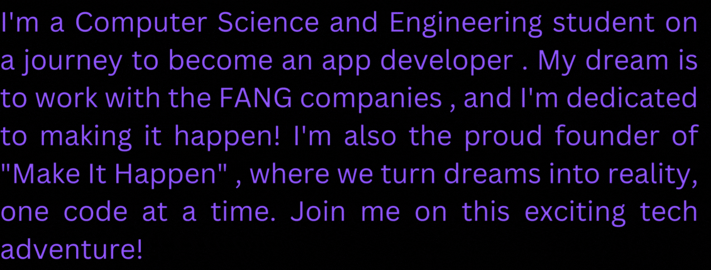

 

 
SKILLS:mortar_board:

<table>
 <td>
  
<td>

   Languages & Backend Development :
    
    
    
    
   
  
   Frontend Development :
    
    
    
    
   
   Softwares :
    
    
    
    
    
    

</td>
</table>

  

  

  

  
FIND ME:computer:

 

 

