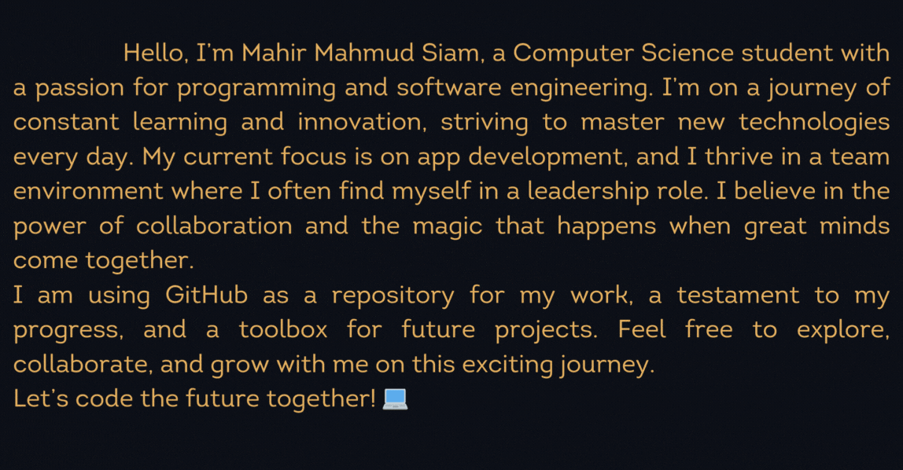

 

 
SKILLS📙

<table>
 <td>
  
<td>

   Languages & Backend Development :
    
    
    
    
    
    
   
  
   Frontend Development :
    
    
    
    
    
   
   Softwares :
    
    
    
    
    
    

</td>
</table>

  

  
 
PROJECTS📦

| Project | Description |
| --- | --- |
| <h2 align="center"><a href="https://github.com/MahirMsiam/ROOMMATE">ROOMMATE</a></h2> | 
A java GUI project for those who are looking for rental properties.
 |
| <h2 align="center"><a href="https://github.com/MahirMsiam/PythonProjects/tree/main/practice">MINIpy</a></h2> | 
mini projects with python cvzone
 |
| <h2 align="center"><a href="https://github.com/MahirMsiam/Webdev">Website</a></h2> | 
E-comerce website using html,css and bootstrap
 |
| <h2 align="center"><a href="https://github.com/MahirMsiam/niyejan">NiyeJan</a></h2> | 
A ride sharing app using flutter,Dart and using firebase.It's a clone of uber.It was made to enhance skills on flutter and dart concepts
 |

<!-- 
| <h2 align="center"><a href="https://github.com/nehlinshanila/Activity-Selection-Problem--CSE373">Activity Selection Problem</a></h2> | 
Implementation of the Activity Selection Problem using the Merge Sort algorithm with greedy approach while selecting a maximum number of non-overlapping activities from a given random array generated activities with their own start time and an end time.
 |
| <h2 align="center"><a href="https://github.com/nehlinshanila/Blood-Donation-Management-System--CSE311">Blood Donation Management System</a></h2> | 
Web-based system that helps the users with the information of different blood types and how they can be utilized in the blood bank to help several clients that are in need.
 |-->

  

  
FIND ME💻

 

 

